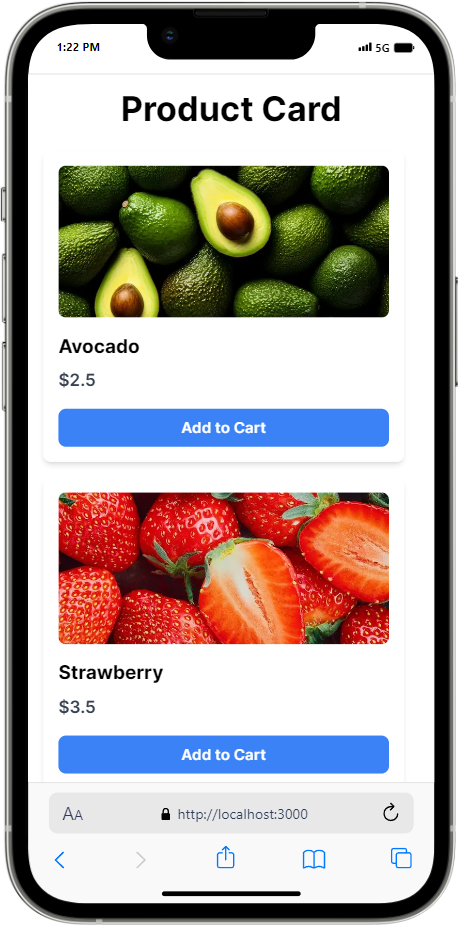

# Product Card

Develop a simple product card component for an e-commerce website. The card should display the product image, title, price, and a button to add the product to the cart.

## Screenshot

| Desktop                                                                                   | Mobile                                                                                         |
| ----------------------------------------------------------------------------------------- | ---------------------------------------------------------------------------------------------- |
|  |  |

## Getting Started

First, clone the repository:

```bash
git clone git@github.com:didapatria/Product-Card.git
```

Second, install the dependencies:

```bash
npm install
```

Third, run the development server:

```bash
npm run dev
```

Open [http://localhost:3000](http://localhost:3000) with your browser to see the result.

## Learn More

To learn more about Next.js, take a look at the following resources:

- [Next.js Documentation](https://nextjs.org/docs) - learn about Next.js features and API.
- [Learn Next.js](https://nextjs.org/learn) - an interactive Next.js tutorial.

You can check out [the Next.js GitHub repository](https://github.com/vercel/next.js/) - your feedback and contributions are welcome!

## Deploy on Vercel

The easiest way to deploy your Next.js app is to use the [Vercel Platform](https://vercel.com/new?utm_medium=default-template&filter=next.js&utm_source=create-next-app&utm_campaign=create-next-app-readme) from the creators of Next.js.

Check out our [Next.js deployment documentation](https://nextjs.org/docs/deployment) for more details.
